# XMR-Forecast — Diagramas

> Todos los diagramas están en **Mermaid** y se renderizan en GitHub, GitLab, VS Code (extensión Mermaid), Obsidian y el editor de [mermaid.live](https://mermaid.live).
> **Aviso legal:** análisis predictivo; no es asesoría financiera ni promete rentabilidad.

## Índice

1. Convenciones
2. Casos de uso (diagrama de usuario)
3. Flujo de usuario (navegación y recorridos)
4. Arquitectura y despliegue
5. Diagramas de clases
6. Diagramas de flujo
7. Diagramas de secuencia
8. Modelo entidad–relación
9. Diagramas de estados

---

## 1. Convenciones

| Elemento | Significado |
|----------|-------------|
| `CU-xx` | Caso de uso (definido en `01_documentacion.md` §5) |
| `RF-xx`, `RNF-xx` | Requisitos funcionales y no funcionales |
| `R-xx` | Reglas inviolables de `AGENTS.md` |
| Cilindro `[( )]` | Base de datos o almacén |
| Rombo `{ }` | Decisión |
| Línea punteada | Herencia de rol o dependencia opcional |

---

## 2. Casos de uso (diagrama de usuario)

Los roles se **heredan**: el analista puede todo lo que hace el visitante, y el administrador todo lo que hace el analista.

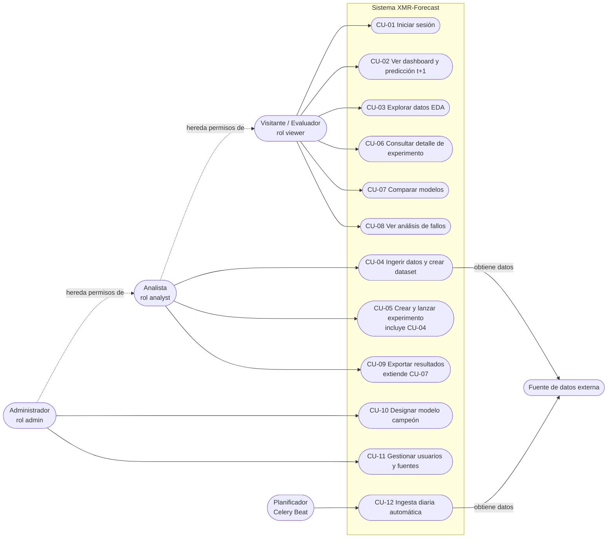
```mermaid
flowchart LR
    V(["Visitante / Evaluador<br/>rol viewer"])
    A(["Analista<br/>rol analyst"])
    AD(["Administrador<br/>rol admin"])
    P(["Planificador<br/>Celery Beat"])
    F(["Fuente de datos externa"])

    A -.->|"hereda permisos de"| V
    AD -.->|"hereda permisos de"| A

    subgraph SYS["Sistema XMR-Forecast"]
        CU01(["CU-01 Iniciar sesión"])
        CU02(["CU-02 Ver dashboard y predicción t+1"])
        CU03(["CU-03 Explorar datos EDA"])
        CU06(["CU-06 Consultar detalle de experimento"])
        CU07(["CU-07 Comparar modelos"])
        CU08(["CU-08 Ver análisis de fallos"])
        CU04(["CU-04 Ingerir datos y crear dataset"])
        CU05(["CU-05 Crear y lanzar experimento<br/>incluye CU-04"])
        CU09(["CU-09 Exportar resultados<br/>extiende CU-07"])
        CU10(["CU-10 Designar modelo campeón"])
        CU11(["CU-11 Gestionar usuarios y fuentes"])
        CU12(["CU-12 Ingesta diaria automática"])
    end

    V --> CU01
    V --> CU02
    V --> CU03
    V --> CU06
    V --> CU07
    V --> CU08
    A --> CU04
    A --> CU05
    A --> CU09
    AD --> CU10
    AD --> CU11
    P --> CU12
    CU04 -->|"obtiene datos"| F
    CU12 -->|"obtiene datos"| F
```

---

## 3. Flujo de usuario

### 3.1 Mapa de navegación

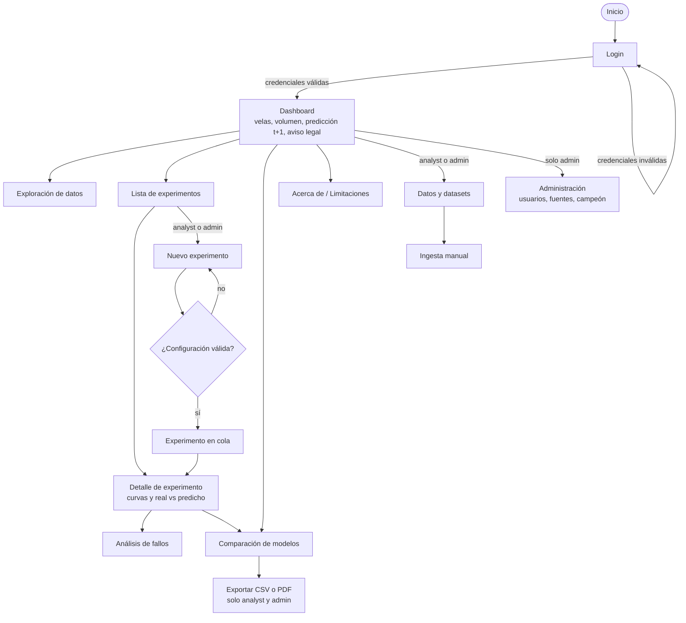
```mermaid
flowchart TD
    S(["Inicio"]) --> L["Login"]
    L -->|"credenciales válidas"| D["Dashboard<br/>velas, volumen, predicción t+1, aviso legal"]
    L -->|"credenciales inválidas"| L

    D --> E["Exploración de datos"]
    D --> EX["Lista de experimentos"]
    D --> CMP["Comparación de modelos"]
    D --> AB["Acerca de / Limitaciones"]

    EX --> DET["Detalle de experimento<br/>curvas y real vs predicho"]
    DET --> FAIL["Análisis de fallos"]
    DET --> CMP
    CMP --> EXP["Exportar CSV o PDF<br/>solo analyst y admin"]

    D -->|"analyst o admin"| DS["Datos y datasets"]
    DS --> ING["Ingesta manual"]
    EX -->|"analyst o admin"| NEW["Nuevo experimento"]
    NEW --> VAL{"¿Configuración válida?"}
    VAL -->|"no"| NEW
    VAL -->|"sí"| QUE["Experimento en cola"]
    QUE --> DET

    D -->|"solo admin"| ADM["Administración<br/>usuarios, fuentes, campeón"]
```

### 3.2 Recorrido del evaluador

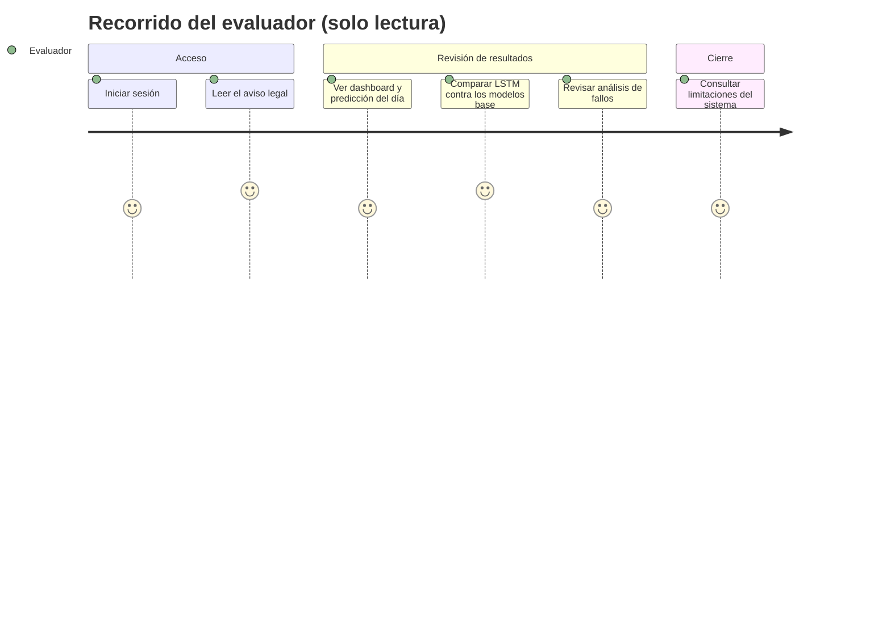
```mermaid
journey
    title Recorrido del evaluador (solo lectura)
    section Acceso
      Iniciar sesión: 4: Evaluador
      Leer el aviso legal: 5: Evaluador
    section Revisión de resultados
      Ver dashboard y predicción del día: 4: Evaluador
      Comparar LSTM contra los modelos base: 5: Evaluador
      Revisar análisis de fallos: 4: Evaluador
    section Cierre
      Consultar limitaciones del sistema: 4: Evaluador
```

### 3.3 Recorrido del analista

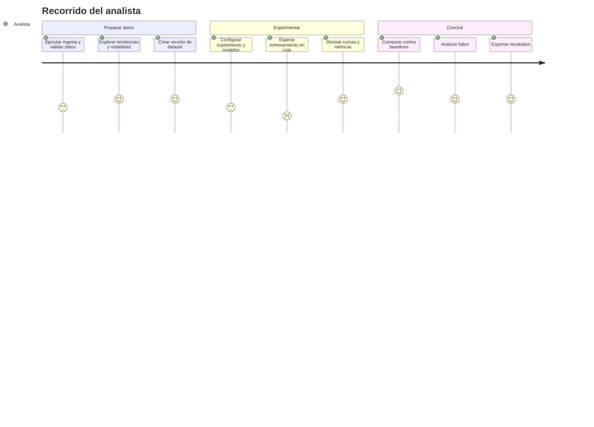
```mermaid
journey
    title Recorrido del analista
    section Preparar datos
      Ejecutar ingesta y validar datos: 3: Analista
      Explorar tendencias y volatilidad: 4: Analista
      Crear versión de dataset: 4: Analista
    section Experimentar
      Configurar experimento y modelos: 3: Analista
      Esperar entrenamiento en cola: 2: Analista
      Revisar curvas y métricas: 4: Analista
    section Concluir
      Comparar contra baselines: 5: Analista
      Analizar fallos: 4: Analista
      Exportar resultados: 4: Analista
```

---

## 4. Arquitectura y despliegue

### 4.1 Arquitectura lógica

El paquete `ml` no depende de FastAPI ni de SQLAlchemy (R-13): el worker y los servicios hacen de puente con la base de datos.

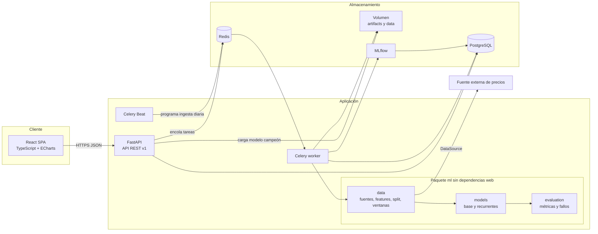
```mermaid
flowchart LR
    subgraph CLIENT["Cliente"]
        SPA["React SPA<br/>TypeScript + ECharts"]
    end

    subgraph APP["Aplicación"]
        API["FastAPI<br/>API REST v1"]
        WK["Celery worker"]
        BT["Celery Beat"]
        subgraph MLPKG["Paquete ml sin dependencias web"]
            DATA["data<br/>fuentes, features, split, ventanas"]
            MOD["models<br/>base y recurrentes"]
            EVAL["evaluation<br/>métricas y fallos"]
        end
    end

    subgraph STORE["Almacenamiento"]
        PG[("PostgreSQL")]
        RD[("Redis")]
        FS["Volumen<br/>artifacts y data"]
        MLF["MLflow"]
    end

    EXT["Fuente externa de precios"]

    SPA -->|"HTTPS JSON"| API
    API --> PG
    API -->|"encola tareas"| RD
    API -->|"carga modelo campeón"| FS
    BT -->|"programa ingesta diaria"| RD
    RD --> WK
    WK --> DATA
    DATA --> MOD
    MOD --> EVAL
    WK --> PG
    WK --> FS
    WK --> MLF
    MLF --> PG
    DATA -->|"DataSource"| EXT
```

### 4.2 Servicios de Docker Compose

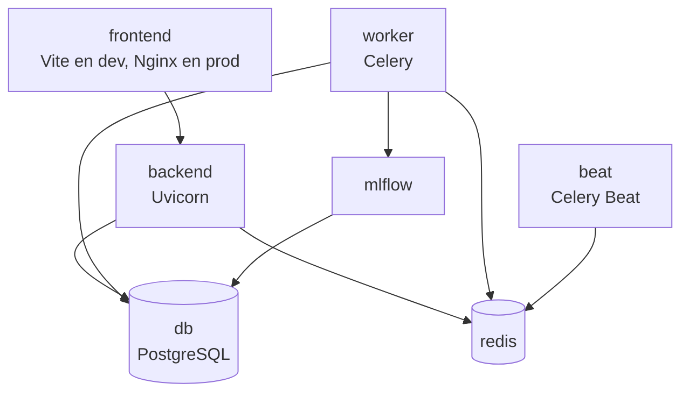
```mermaid
flowchart TD
    FE["frontend<br/>Vite en dev, Nginx en prod"] --> BE["backend<br/>Uvicorn"]
    BE --> DB[("db<br/>PostgreSQL")]
    BE --> RS[("redis")]
    WK["worker<br/>Celery"] --> DB
    WK --> RS
    WK --> MLF["mlflow"]
    BT["beat<br/>Celery Beat"] --> RS
    MLF --> DB
```

---

## 5. Diagramas de clases

### 5.1 Datos y preprocesamiento (`ml/data`)

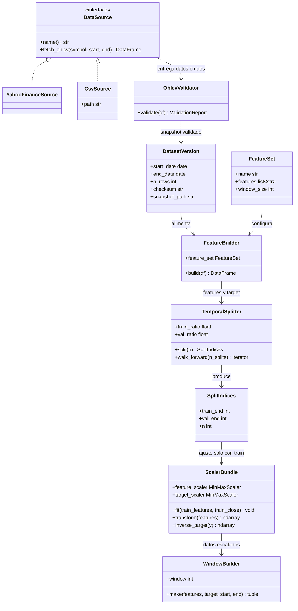
```mermaid
classDiagram
    class DataSource {
        <<interface>>
        +name() str
        +fetch_ohlcv(symbol, start, end) DataFrame
    }
    class YahooFinanceSource
    class CsvSource {
        +path str
    }
    class OhlcvValidator {
        +validate(df) ValidationReport
    }
    class DatasetVersion {
        +start_date date
        +end_date date
        +n_rows int
        +checksum str
        +snapshot_path str
    }
    class FeatureSet {
        +name str
        +features list~str~
        +window_size int
    }
    class FeatureBuilder {
        +feature_set FeatureSet
        +build(df) DataFrame
    }
    class TemporalSplitter {
        +train_ratio float
        +val_ratio float
        +split(n) SplitIndices
        +walk_forward(n_splits) Iterator
    }
    class SplitIndices {
        +train_end int
        +val_end int
        +n int
    }
    class ScalerBundle {
        +feature_scaler MinMaxScaler
        +target_scaler MinMaxScaler
        +fit(train_features, train_close) void
        +transform(features) ndarray
        +inverse_target(y) ndarray
    }
    class WindowBuilder {
        +window int
        +make(features, target, start, end) tuple
    }

    DataSource <|.. YahooFinanceSource
    DataSource <|.. CsvSource
    DataSource ..> OhlcvValidator : entrega datos crudos
    OhlcvValidator ..> DatasetVersion : snapshot validado
    DatasetVersion --> FeatureBuilder : alimenta
    FeatureSet --> FeatureBuilder : configura
    FeatureBuilder --> TemporalSplitter : features y target
    TemporalSplitter --> SplitIndices : produce
    SplitIndices --> ScalerBundle : ajuste solo con train
    ScalerBundle --> WindowBuilder : datos escalados
```

### 5.2 Modelos, evaluación y experimentos (`ml/models`, `ml/evaluation`, `ml/pipelines`)

```mermaid
classDiagram
    class TaskType {
        <<enumeration>>
        REGRESSION
        DIRECTION
    }
    class ForecastModel {
        <<abstract>>
        +name str
        +task_type TaskType
        +fit(train, val) void
        +predict(X) ndarray
        +get_params() dict
    }
    class PersistenceModel
    class MajorityClassModel
    class MovingAverageModel {
        +k int
    }
    class LinearRegressionModel {
        +fit_intercept bool
    }
    class ArimaModel {
        +order tuple
        +predict_rolling(history, future) ndarray
    }
    class RecurrentModel {
        +cell_type str
        +units list~int~
        +dropout float
        +learning_rate float
        +epochs int
        +batch_size int
        +build() Model
    }
    class LstmModel
    class GruModel

    class MetricsCalculator {
        +mae(y, y_hat) float
        +rmse(y, y_hat) float
        +mape(y, y_hat) float
        +directional_accuracy(prev, y, y_hat) float
    }
    class Evaluator {
        +evaluate(model, data, subset) EvaluationResult
        +compare(results) ComparisonTable
    }
    class FailureAnalyzer {
        +top_errors(k) DataFrame
        +errors_by_volatility_regime() DataFrame
        +peak_smoothing_ratio() float
        +mean_residual() float
    }
    class HyperparameterTuner {
        +search_space dict
        +optimize(model_cls, data, n_trials) dict
    }
    class ExperimentConfig {
        +task TaskType
        +feature_set str
        +window int
        +seeds list~int~
        +models list~str~
    }
    class ExperimentRunner {
        +config ExperimentConfig
        +run() list~RunResult~
    }
    class ExperimentTracker {
        <<interface>>
        +log_params(params) void
        +log_metrics(metrics, step) void
        +log_artifact(path) void
    }
    class MlflowTracker

    ForecastModel <|-- PersistenceModel
    ForecastModel <|-- MajorityClassModel
    ForecastModel <|-- MovingAverageModel
    ForecastModel <|-- LinearRegressionModel
    ForecastModel <|-- ArimaModel
    ForecastModel <|-- RecurrentModel
    RecurrentModel <|-- LstmModel
    RecurrentModel <|-- GruModel
    ForecastModel --> TaskType

    ExperimentRunner --> ExperimentConfig
    ExperimentRunner --> ForecastModel : entrena
    ExperimentRunner --> HyperparameterTuner : ajusta en validación
    ExperimentRunner --> Evaluator : evalúa en test
    ExperimentRunner --> ExperimentTracker : registra
    Evaluator --> MetricsCalculator
    Evaluator --> FailureAnalyzer
    ExperimentTracker <|.. MlflowTracker
```

### 5.3 Dominio de la aplicación (`app/db`, `app/services`, `app/workers`)

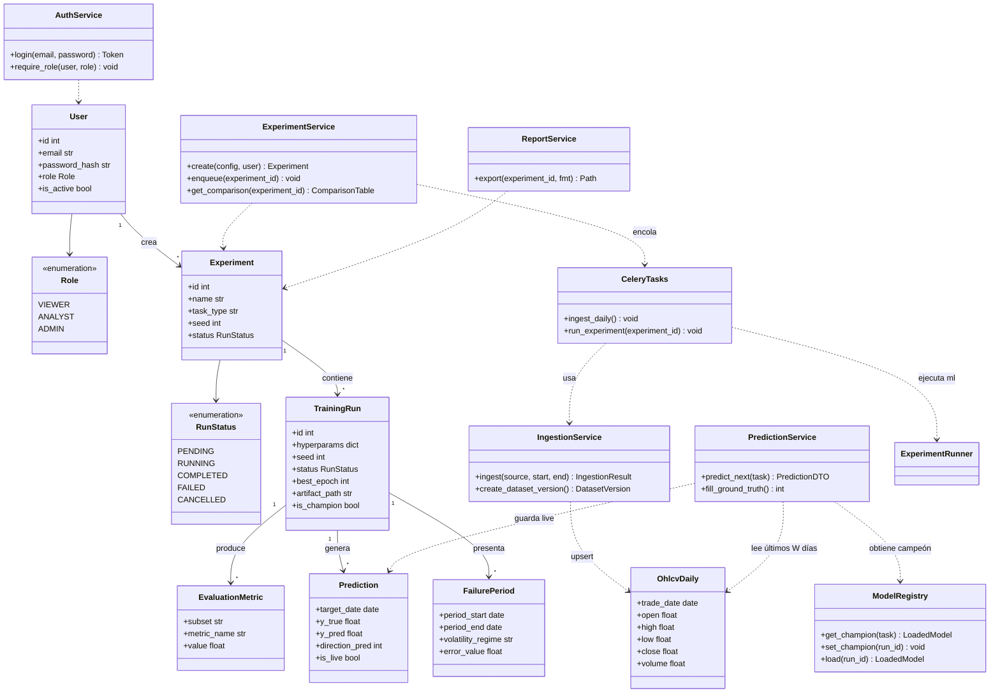
```mermaid
classDiagram
    class Role {
        <<enumeration>>
        VIEWER
        ANALYST
        ADMIN
    }
    class RunStatus {
        <<enumeration>>
        PENDING
        RUNNING
        COMPLETED
        FAILED
        CANCELLED
    }
    class User {
        +id int
        +email str
        +password_hash str
        +role Role
        +is_active bool
    }
    class Experiment {
        +id int
        +name str
        +task_type str
        +seed int
        +status RunStatus
    }
    class TrainingRun {
        +id int
        +hyperparams dict
        +seed int
        +status RunStatus
        +best_epoch int
        +artifact_path str
        +is_champion bool
    }
    class EvaluationMetric {
        +subset str
        +metric_name str
        +value float
    }
    class Prediction {
        +target_date date
        +y_true float
        +y_pred float
        +direction_pred int
        +is_live bool
    }
    class FailurePeriod {
        +period_start date
        +period_end date
        +volatility_regime str
        +error_value float
    }
    class OhlcvDaily {
        +trade_date date
        +open float
        +high float
        +low float
        +close float
        +volume float
    }

    class AuthService {
        +login(email, password) Token
        +require_role(user, role) void
    }
    class IngestionService {
        +ingest(source, start, end) IngestionResult
        +create_dataset_version() DatasetVersion
    }
    class ExperimentService {
        +create(config, user) Experiment
        +enqueue(experiment_id) void
        +get_comparison(experiment_id) ComparisonTable
    }
    class PredictionService {
        +predict_next(task) PredictionDTO
        +fill_ground_truth() int
    }
    class ModelRegistry {
        +get_champion(task) LoadedModel
        +set_champion(run_id) void
        +load(run_id) LoadedModel
    }
    class ReportService {
        +export(experiment_id, fmt) Path
    }
    class CeleryTasks {
        +ingest_daily() void
        +run_experiment(experiment_id) void
    }

    User --> Role
    User "1" --> "*" Experiment : crea
    Experiment "1" --> "*" TrainingRun : contiene
    TrainingRun "1" --> "*" EvaluationMetric : produce
    TrainingRun "1" --> "*" Prediction : genera
    TrainingRun "1" --> "*" FailurePeriod : presenta
    Experiment --> RunStatus

    AuthService ..> User
    ExperimentService ..> Experiment
    ExperimentService ..> CeleryTasks : encola
    CeleryTasks ..> IngestionService : usa
    CeleryTasks ..> ExperimentRunner : ejecuta ml
    IngestionService ..> OhlcvDaily : upsert
    PredictionService ..> ModelRegistry : obtiene campeón
    PredictionService ..> OhlcvDaily : lee últimos W días
    PredictionService ..> Prediction : guarda live
    ReportService ..> Experiment
```

---

## 6. Diagramas de flujo

### 6.1 Pipeline de ML de extremo a extremo

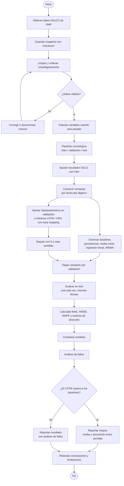
```mermaid
flowchart TD
    A(["Inicio"]) --> B["Obtener datos OHLCV de XMR"]
    B --> C["Guardar snapshot con checksum"]
    C --> D["Limpiar y ordenar cronológicamente"]
    D --> E{"¿Datos válidos?"}
    E -->|"no"| E1["Corregir o documentar huecos"] --> D
    E -->|"sí"| F["Calcular variables usando solo pasado"]
    F --> G["Partición cronológica<br/>train / validación / test"]
    G --> H["Ajustar escalador SOLO con train"]
    H --> I["Construir ventanas<br/>por fecha del objetivo"]
    I --> J["Entrenar baselines<br/>persistencia, media móvil, regresión lineal, ARIMA"]
    I --> K["Ajustar hiperparámetros en validación<br/>y entrenar LSTM / GRU con early stopping"]
    K --> L["Repetir con 5 o más semillas"]
    J --> M["Elegir campeón por validación"]
    L --> M
    M --> N["Evaluar en test<br/>una sola vez, mismas fechas"]
    N --> O["Calculate MAE, RMSE, MAPE y aciertos de dirección"]
    O --> P["Comparar modelos"]
    P --> Q["Análisis de fallos"]
    Q --> R{"¿El LSTM supera a los baselines?"}
    R -->|"sí"| R1["Reportar mejora<br/>media ± desviación entre semillas"]
    R -->|"no"| R2["Reportar resultado<br/>con análisis de fallos"]
    R1 --> S["Redactar conclusiones y limitaciones"]
    R2 --> S
    S --> T(["Fin"])
```

### 6.2 Ingesta diaria automática (CU-12)

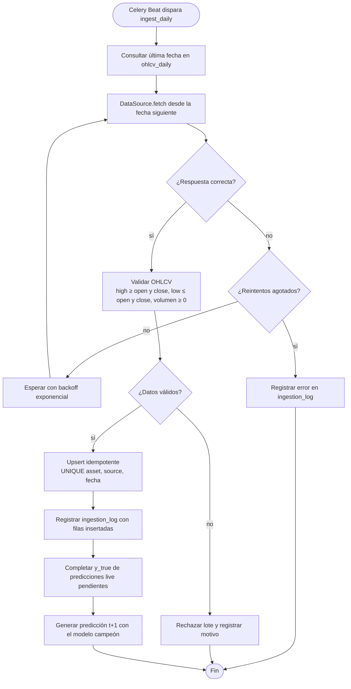
```mermaid
flowchart TD
    A(["Celery Beat dispara ingest_daily"]) --> B["Consultar última fecha en ohlcv_daily"]
    B --> C["DataSource.fetch desde la fecha siguiente"]
    C --> D{"¿Respuesta correcta?"}
    D -->|"no"| E{"¿Reintentos agotados?"}
    E -->|"no"| F["Esperar con backoff exponencial"] --> C
    E -->|"sí"| G["Registrar error en ingestion_log"] --> Z(["Fin"])
    D -->|"sí"| H["Validar OHLCV<br/>high ≥ open y close, low ≤ open y close, volumen ≥ 0"]
    H --> I{"¿Datos válidos?"}
    I -->|"no"| J["Rechazar lote y registrar motivo"] --> Z
    I -->|"sí"| K["Upsert idempotente<br/>UNIQUE asset, source, fecha"]
    K --> L["Registrar ingestion_log con filas insertadas"]
    L --> M["Completar y_true de predicciones live pendientes"]
    M --> N["Generar predicción t+1 con el modelo campeón"]
    N --> Z
```

### 6.3 Entrenamiento de un modelo recurrente

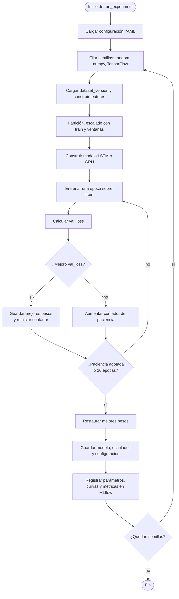
```mermaid
flowchart TD
    A(["Inicio de run_experiment"]) --> B["Cargar configuración YAML"]
    B --> C["Fijar semillas: random, numpy, TensorFlow"]
    C --> D["Cargar dataset_version y construir features"]
    D --> E["Partición, escalado con train y ventanas"]
    E --> F["Construir modelo LSTM o GRU"]
    F --> G["Entrenar una época sobre train"]
    G --> H["Calcular val_loss"]
    H --> I{"¿Mejoró val_loss?"}
    I -->|"sí"| J["Guardar mejores pesos<br/>y reiniciar contador"]
    I -->|"no"| K["Aumentar contador de paciencia"]
    J --> L{"¿Paciencia agotada<br/>o 20 épocas?"}
    K --> L
    L -->|"no"| G
    L -->|"sí"| M["Restaurar mejores pesos"]
    M --> N["Guardar modelo, escalador y configuración"]
    N --> O["Registrar parámetros, curvas y métricas en MLflow"]
    O --> P{"¿Quedan semillas?"}
    P -->|"sí"| C
    P -->|"no"| Q(["Fin"])
```

### 6.4 Consulta de la predicción del día (CU-02)

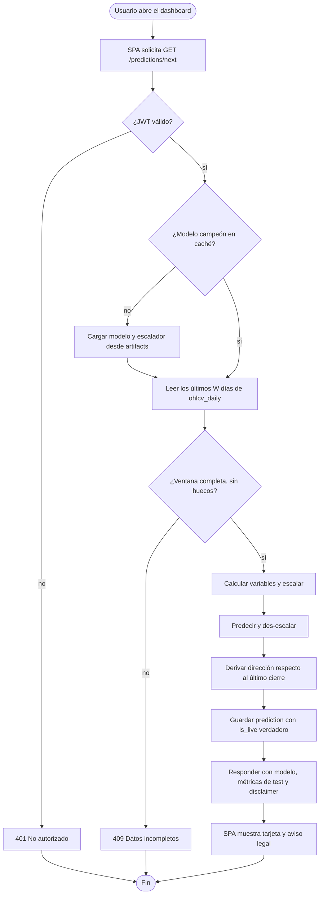
```mermaid
flowchart TD
    A(["Usuario abre el dashboard"]) --> B["SPA solicita GET /predictions/next"]
    B --> C{"¿JWT válido?"}
    C -->|"no"| C1["401 No autorizado"] --> Z(["Fin"])
    C -->|"sí"| D{"¿Modelo campeón en caché?"}
    D -->|"no"| E["Cargar modelo y escalador desde artifacts"] --> F
    D -->|"sí"| F["Leer los últimos W días de ohlcv_daily"]
    F --> G{"¿Ventana completa, sin huecos?"}
    G -->|"no"| G1["409 Datos incompletos"] --> Z
    G -->|"sí"| H["Calcular variables y escalar"]
    H --> I["Predecir y des-escalar"]
    I --> J["Derivar dirección respecto al último cierre"]
    J --> K["Guardar prediction con is_live verdadero"]
    K --> L["Responder con modelo, métricas de test y disclaimer"]
    L --> M["SPA muestra tarjeta y aviso legal"]
    M --> Z
```

---

## 7. Diagramas de secuencia

### 7.1 Crear y ejecutar un experimento (CU-05)

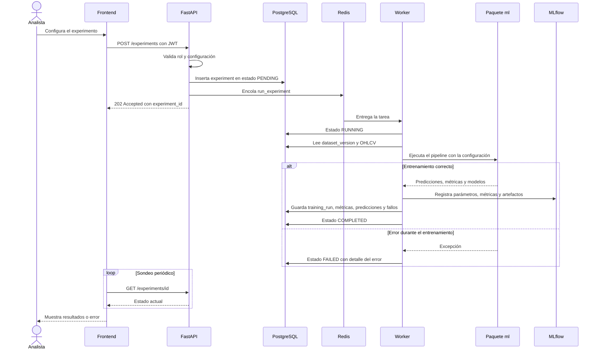
```mermaid
sequenceDiagram
    actor U as Analista
    participant SPA as Frontend
    participant API as FastAPI
    participant PG as PostgreSQL
    participant Q as Redis
    participant W as Worker
    participant ML as Paquete ml
    participant MF as MLflow

    U->>SPA: Configura el experimento
    SPA->>API: POST /experiments con JWT
    API->>API: Valida rol y configuración
    API->>PG: Inserta experiment en estado PENDING
    API->>Q: Encola run_experiment
    API-->>SPA: 202 Accepted con experiment_id
    Q->>W: Entrega la tarea
    W->>PG: Estado RUNNING
    W->>PG: Lee dataset_version y OHLCV
    W->>ML: Ejecuta el pipeline con la configuración
    alt Entrenamiento correcto
        ML-->>W: Predicciones, métricas y modelos
        W->>MF: Registra parámetros, métricas y artefactos
        W->>PG: Guarda training_run, métricas, predicciones y fallos
        W->>PG: Estado COMPLETED
    else Error durante el entrenamiento
        ML-->>W: Excepción
        W->>PG: Estado FAILED con detalle del error
    end
    loop Sondeo periódico
        SPA->>API: GET /experiments/id
        API-->>SPA: Estado actual
    end
    SPA-->>U: Muestra resultados o error
```

### 7.2 Predicción del día siguiente (CU-02)

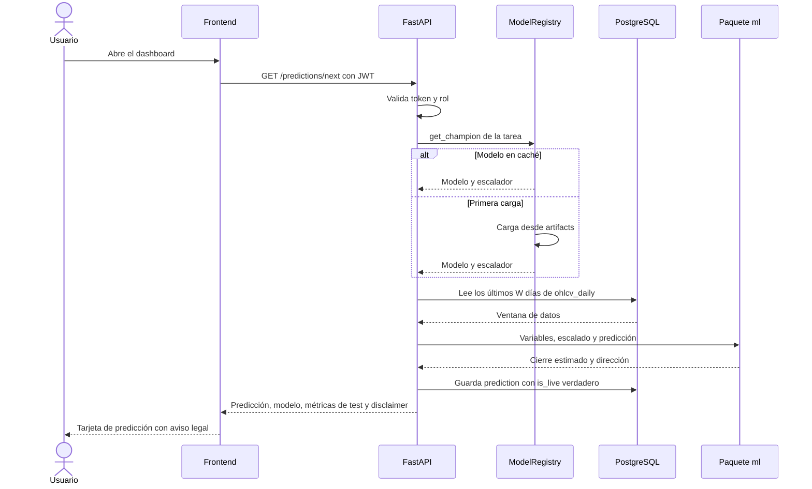
```mermaid
sequenceDiagram
    actor U as Usuario
    participant SPA as Frontend
    participant API as FastAPI
    participant REG as ModelRegistry
    participant PG as PostgreSQL
    participant ML as Paquete ml

    U->>SPA: Abre el dashboard
    SPA->>API: GET /predictions/next con JWT
    API->>API: Valida token y rol
    API->>REG: get_champion de la tarea
    alt Modelo en caché
        REG-->>API: Modelo y escalador
    else Primera carga
        REG->>REG: Carga desde artifacts
        REG-->>API: Modelo y escalador
    end
    API->>PG: Lee los últimos W días de ohlcv_daily
    PG-->>API: Ventana de datos
    API->>ML: Variables, escalado y predicción
    ML-->>API: Cierre estimado y dirección
    API->>PG: Guarda prediction con is_live verdadero
    API-->>SPA: Predicción, modelo, métricas de test y disclaimer
    SPA-->>U: Tarjeta de predicción con aviso legal
```

### 7.3 Ingesta diaria (CU-12)

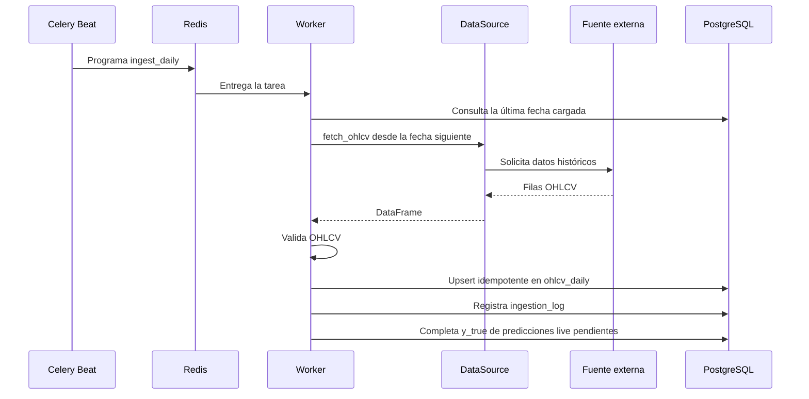
```mermaid
sequenceDiagram
    participant BT as Celery Beat
    participant Q as Redis
    participant W as Worker
    participant DS as DataSource
    participant EXT as Fuente externa
    participant PG as PostgreSQL

    BT->>Q: Programa ingest_daily
    Q->>W: Entrega la tarea
    W->>PG: Consulta la última fecha cargada
    W->>DS: fetch_ohlcv desde la fecha siguiente
    DS->>EXT: Solicita datos históricos
    EXT-->>DS: Filas OHLCV
    DS-->>W: DataFrame
    W->>W: Valida OHLCV
    W->>PG: Upsert idempotente en ohlcv_daily
    W->>PG: Registra ingestion_log
    W->>PG: Completa y_true de predicciones live pendientes
```

---

## 8. Modelo entidad–relación

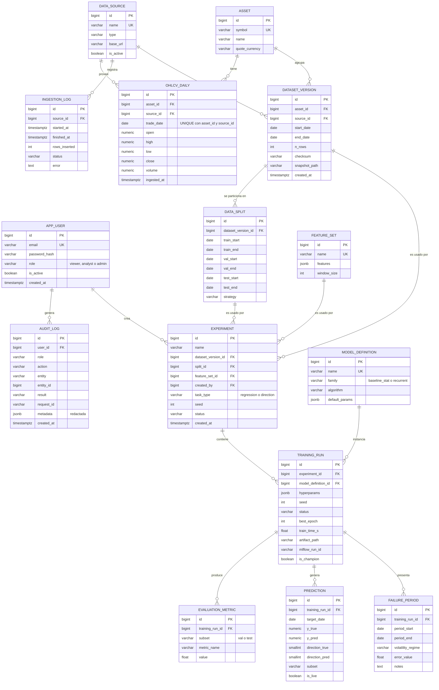
```mermaid
erDiagram
    APP_USER ||--o{ AUDIT_LOG : genera
    APP_USER ||--o{ EXPERIMENT : crea
    DATA_SOURCE ||--o{ OHLCV_DAILY : provee
    ASSET ||--o{ OHLCV_DAILY : tiene
    DATA_SOURCE ||--o{ INGESTION_LOG : registra
    ASSET ||--o{ DATASET_VERSION : agrupa
    DATA_SOURCE ||--o{ DATASET_VERSION : origina
    DATASET_VERSION ||--o{ DATA_SPLIT : "se particiona en"
    DATASET_VERSION ||--o{ EXPERIMENT : "es usado por"
    DATA_SPLIT ||--o{ EXPERIMENT : "es usado por"
    FEATURE_SET ||--o{ EXPERIMENT : "es usado por"
    EXPERIMENT ||--o{ TRAINING_RUN : contiene
    MODEL_DEFINITION ||--o{ TRAINING_RUN : instancia
    TRAINING_RUN ||--o{ EVALUATION_METRIC : produce
    TRAINING_RUN ||--o{ PREDICTION : genera
    TRAINING_RUN ||--o{ FAILURE_PERIOD : presenta

    APP_USER {
        bigint id PK
        varchar email UK
        varchar password_hash
        varchar role "viewer, analyst o admin"
        boolean is_active
        timestamptz created_at
    }
    AUDIT_LOG {
        bigint id PK
        bigint user_id FK
        varchar role
        varchar action
        varchar entity
        bigint entity_id
        varchar result
        varchar request_id
        jsonb metadata "redactada"
        timestamptz created_at
    }
    DATA_SOURCE {
        bigint id PK
        varchar name UK
        varchar type
        varchar base_url
        boolean is_active
    }
    ASSET {
        bigint id PK
        varchar symbol UK
        varchar name
        varchar quote_currency
    }
    OHLCV_DAILY {
        bigint id PK
        bigint asset_id FK
        bigint source_id FK
        date trade_date "UNIQUE con asset_id y source_id"
        numeric open
        numeric high
        numeric low
        numeric close
        numeric volume
        timestamptz ingested_at
    }
    INGESTION_LOG {
        bigint id PK
        bigint source_id FK
        timestamptz started_at
        timestamptz finished_at
        int rows_inserted
        varchar status
        text error
    }
    DATASET_VERSION {
        bigint id PK
        bigint asset_id FK
        bigint source_id FK
        date start_date
        date end_date
        int n_rows
        varchar checksum
        varchar snapshot_path
        timestamptz created_at
    }
    DATA_SPLIT {
        bigint id PK
        bigint dataset_version_id FK
        date train_start
        date train_end
        date val_start
        date val_end
        date test_start
        date test_end
        varchar strategy
    }
    FEATURE_SET {
        bigint id PK
        varchar name UK
        jsonb features
        int window_size
    }
    MODEL_DEFINITION {
        bigint id PK
        varchar name UK
        varchar family "baseline_stat o recurrent"
        varchar algorithm
        jsonb default_params
    }
    EXPERIMENT {
        bigint id PK
        varchar name
        bigint dataset_version_id FK
        bigint split_id FK
        bigint feature_set_id FK
        bigint created_by FK
        varchar task_type "regression o direction"
        int seed
        varchar status
        timestamptz created_at
    }
    TRAINING_RUN {
        bigint id PK
        bigint experiment_id FK
        bigint model_definition_id FK
        jsonb hyperparams
        int seed
        varchar status
        int best_epoch
        float train_time_s
        varchar artifact_path
        varchar mlflow_run_id
        boolean is_champion
    }
    EVALUATION_METRIC {
        bigint id PK
        bigint training_run_id FK
        varchar subset "val o test"
        varchar metric_name
        float value
    }
    PREDICTION {
        bigint id PK
        bigint training_run_id FK
        date target_date
        numeric y_true
        numeric y_pred
        smallint direction_true
        smallint direction_pred
        varchar subset
        boolean is_live
    }
    FAILURE_PERIOD {
        bigint id PK
        bigint training_run_id FK
        date period_start
        date period_end
        varchar volatility_regime
        float error_value
        text notes
    }
```

---

## 9. Diagramas de estados

### 9.1 Ciclo de vida de un experimento o corrida

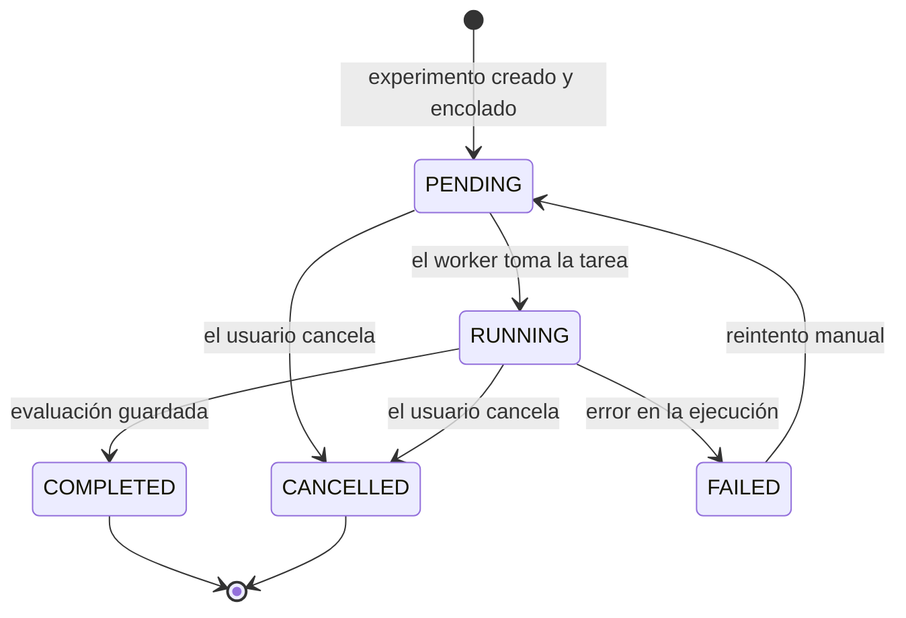
```mermaid
stateDiagram-v2
    [*] --> PENDING : experimento creado y encolado
    PENDING --> RUNNING : el worker toma la tarea
    PENDING --> CANCELLED : el usuario cancela
    RUNNING --> COMPLETED : evaluación guardada
    RUNNING --> FAILED : error en la ejecución
    RUNNING --> CANCELLED : el usuario cancela
    FAILED --> PENDING : reintento manual
    COMPLETED --> [*]
    CANCELLED --> [*]
```

### 9.2 Ciclo de vida de una predicción en operación

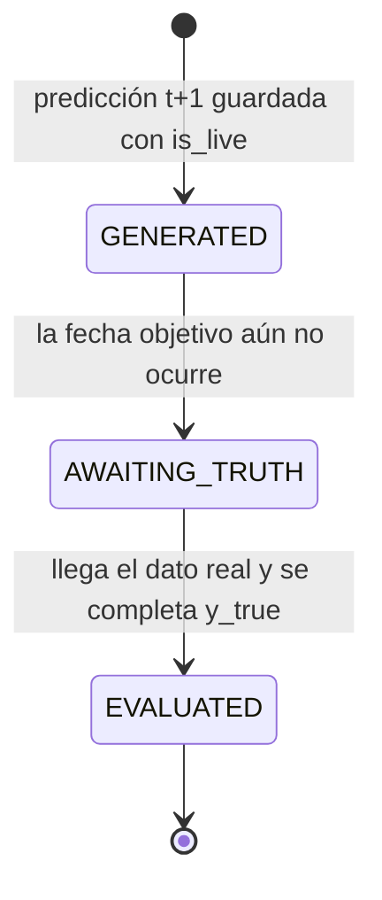
```mermaid
stateDiagram-v2
    [*] --> GENERATED : predicción t+1 guardada con is_live
    GENERATED --> AWAITING_TRUTH : la fecha objetivo aún no ocurre
    AWAITING_TRUTH --> EVALUATED : llega el dato real y se completa y_true
    EVALUATED --> [*]
```
