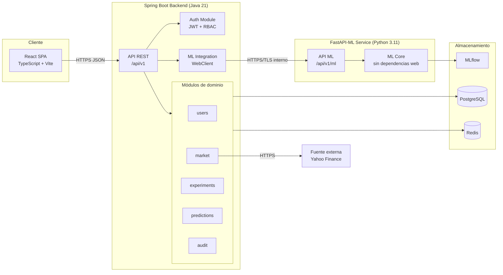
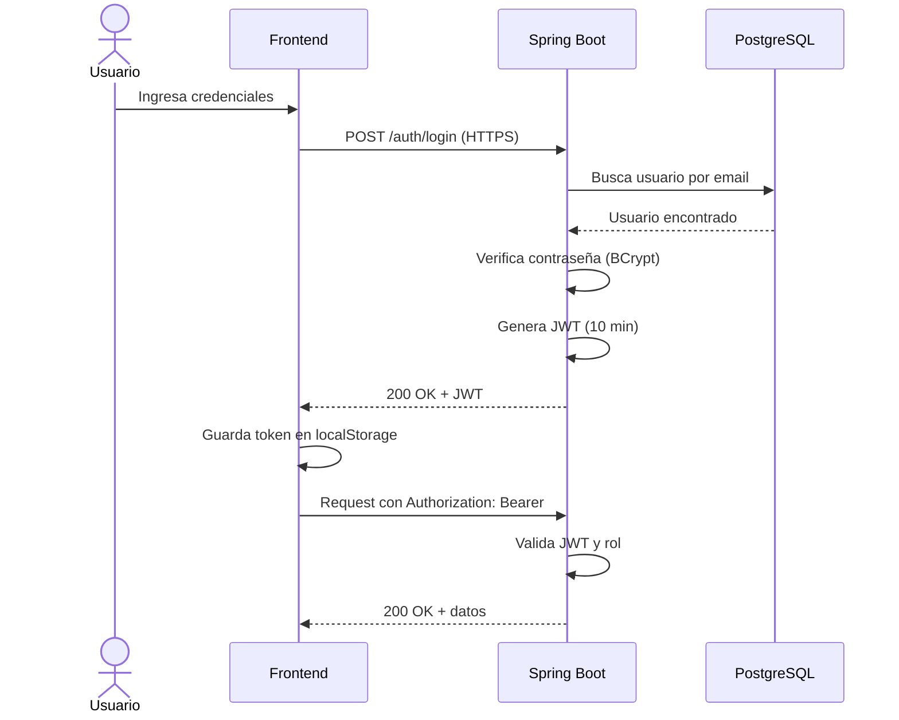
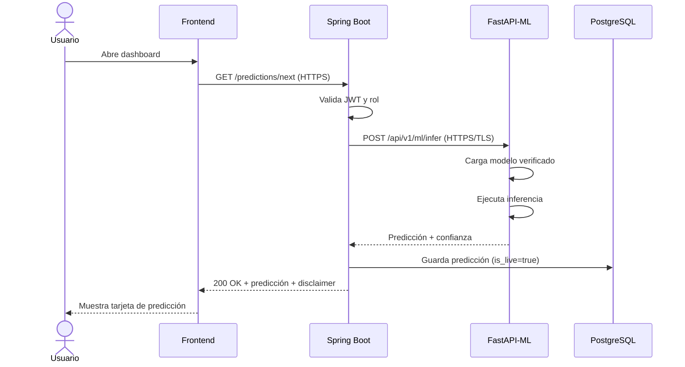
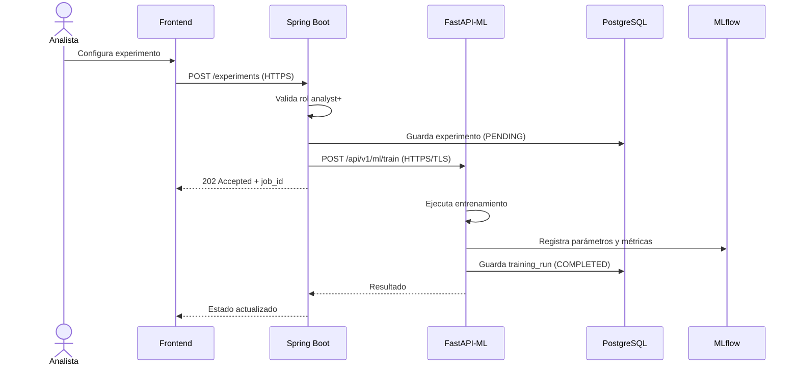
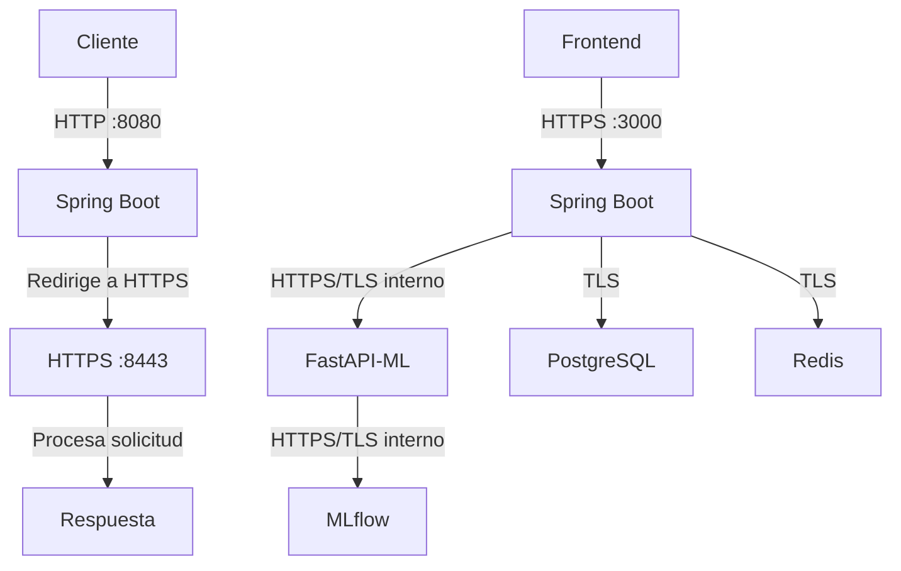
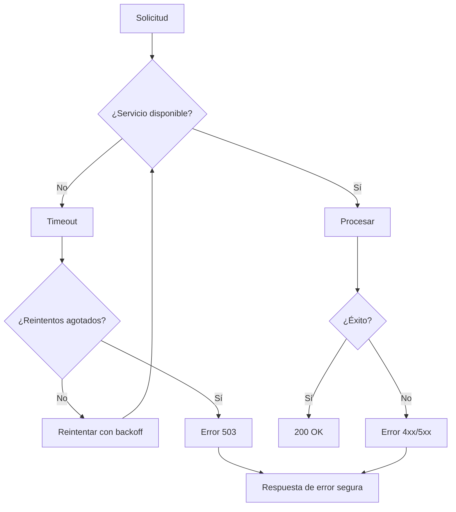
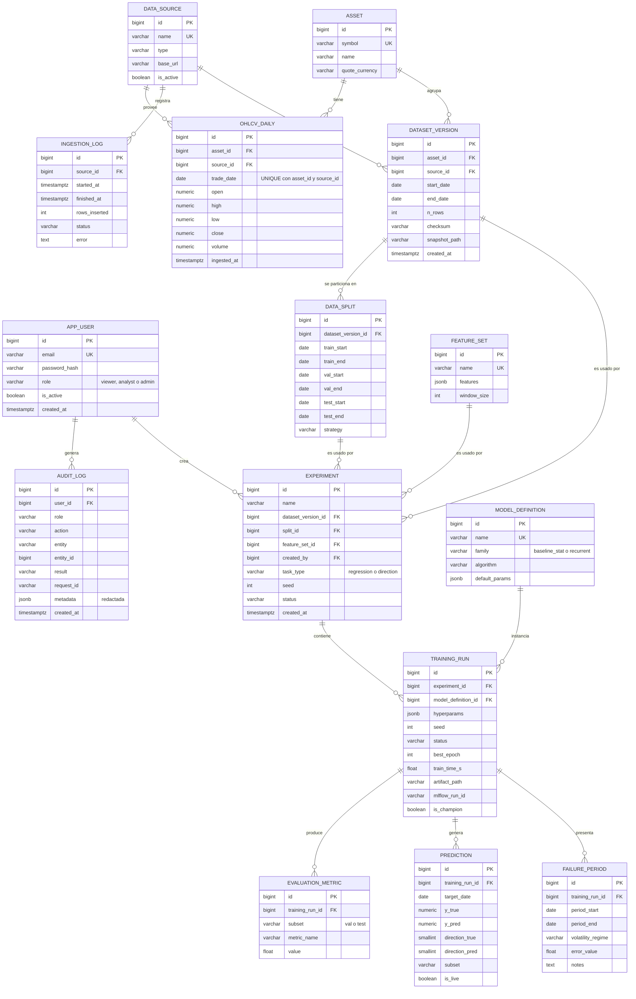
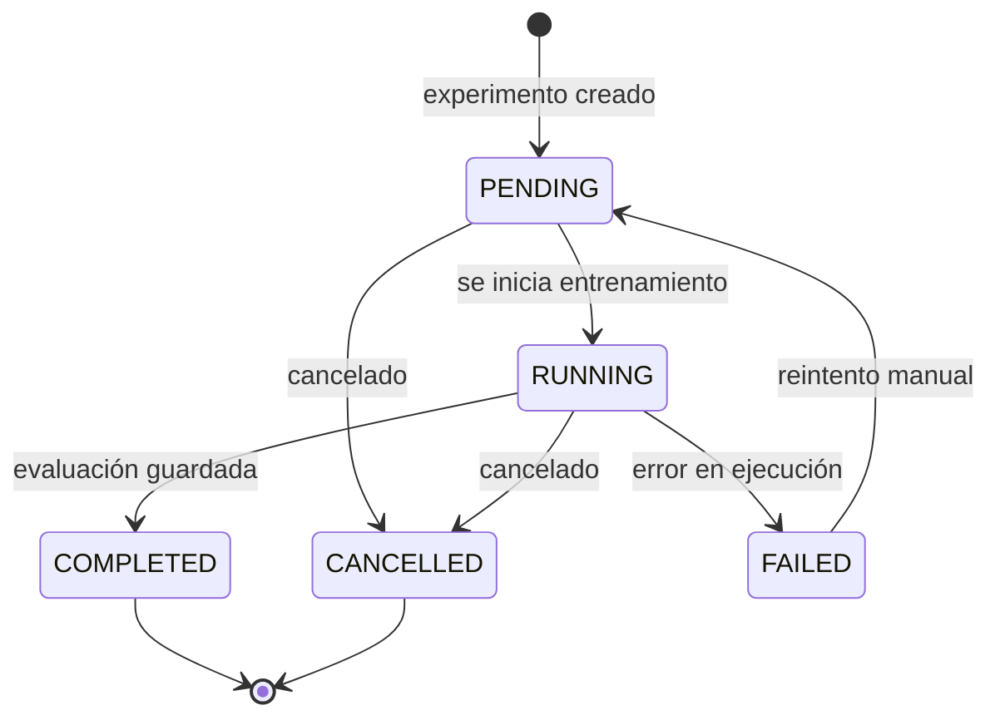
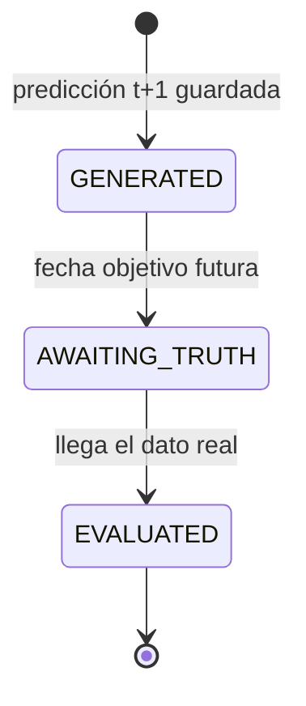

# XMR-Forecast — Diagramas

> Todos los diagramas están en **Mermaid** y se renderizan en GitHub, GitLab, VS Code (extensión Mermaid), Obsidian y el editor de [mermaid.live](https://mermaid.live).
> **Aviso legal:** análisis predictivo; no es asesoría financiera ni promete rentabilidad.

---

## 1. Arquitectura del sistema

---

## 2. Flujo de autenticación

---

## 3. Flujo de predicción

---

## 4. Flujo de entrenamiento

---

## 5. Flujo HTTPS

---

## 6. Flujo de errores e indisponibilidad

---

## 7. Modelo entidad–relación

---

## 8. Diagramas de estados

### 8.1 Ciclo de vida de un experimento

### 8.2 Ciclo de vida de una predicción

