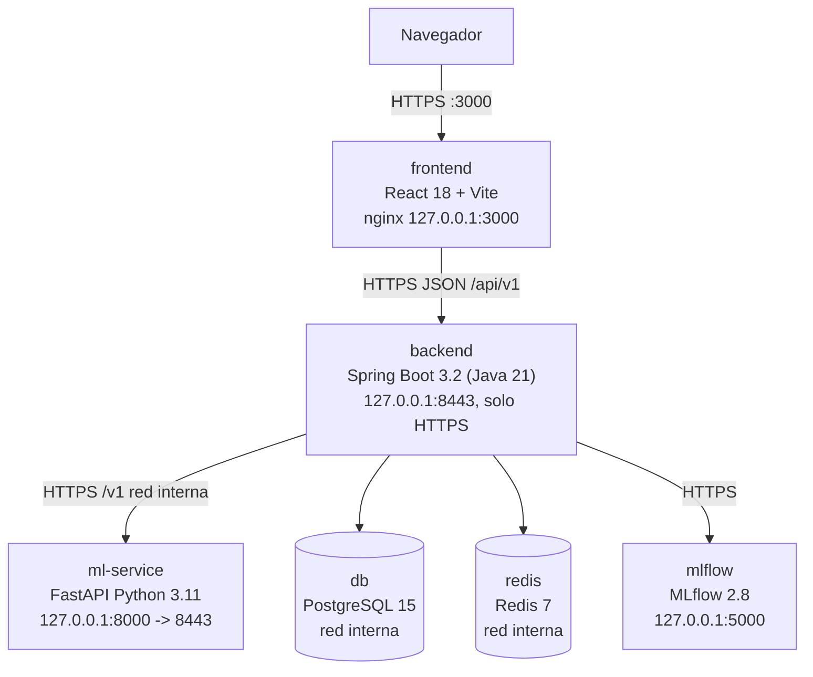
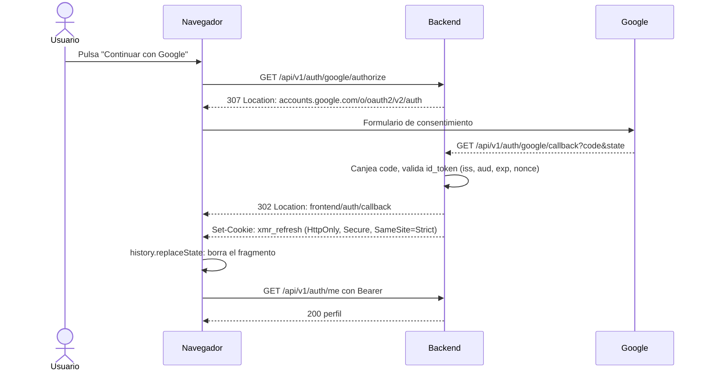
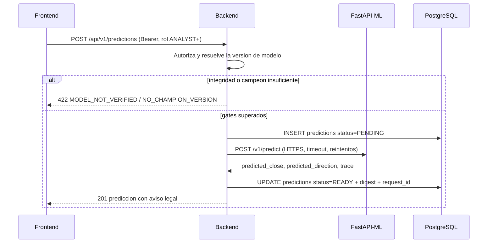
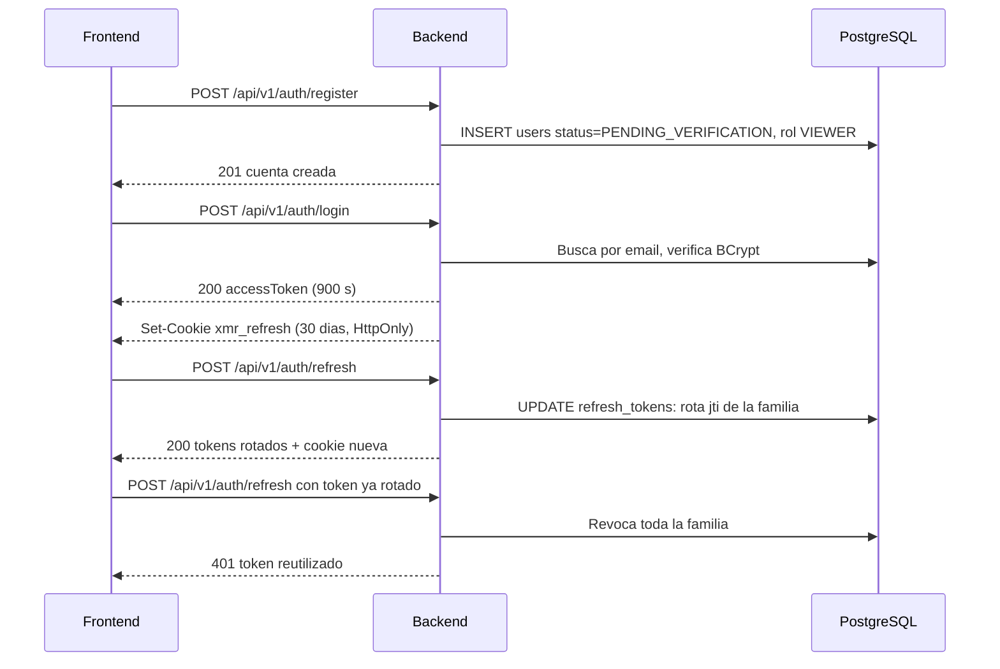
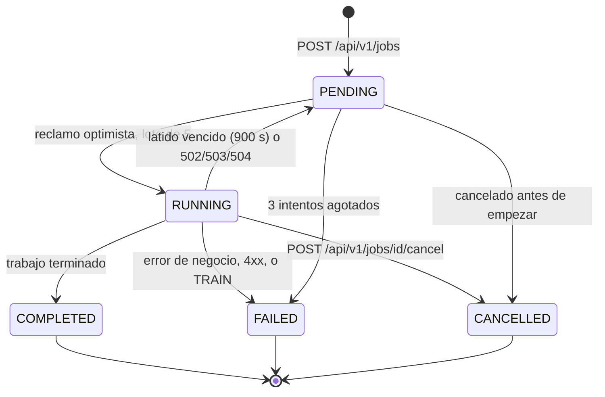
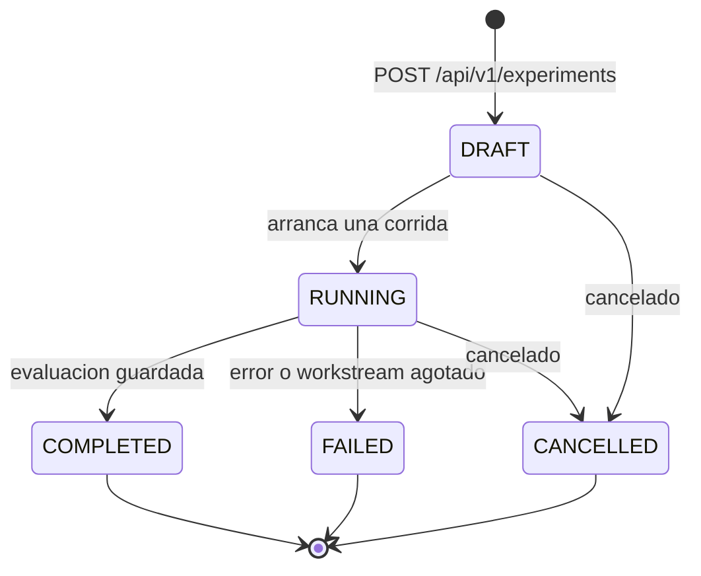

# XMR-Forecast -- Diagramas

> Todos los diagramas estan en **Mermaid** y se renderizan en GitHub, GitLab, VS Code (extension Mermaid), Obsidian y el editor de [mermaid.live](https://mermaid.live).
> **Aviso legal:** analisis predictivo de series de tiempo; no es asesoria financiera, no promete rentabilidad y no simula operaciones de trading (R-11, R-12).
> Cada diagrama de este documento esta validado con **parse + render** mediante `tools/validate_mermaid.py` (R-25, R-40).
> Las entidades, rutas y puertos coinciden con el codigo real: 13 controladores y 46 rutas bajo `/api/v1`, cuatro rutas en el servicio ML con prefijo `/v1`, 22 tablas creadas por las migraciones Flyway `V1`..`V5`.

---

## 1. Arquitectura del sistema

El backend solo expone **HTTPS** (`server.ssl.enabled: true`, unico conector): no hay puerto 8080 ni redireccion de HTTP a HTTPS. `db`, `redis` y `ml-service` viven en una red `internal: true` sin puerto publicado.

**Reglas del diagrama:**

- El navegador solo alcanza al frontend y al backend; nunca a PostgreSQL, Redis, MLflow ni al servicio ML.
- El servicio ML no es publico: lo consume unicamente el backend con cliente tipado, timeout, reintentos limitados y correlacion de solicitudes (R-32).
- El esquema de PostgreSQL lo administra solo Flyway desde el backend; el servicio ML no lo toca (R-34).
- `docker-compose.dev.yml` publica ademas `postgres` en `127.0.0.1:55432` y `redis` en `127.0.0.1:56379` sobre una red **no interna**, porque una red `internal: true` no tiene ruta de vuelta al host y publicar alli no hace nada.

---

## 2. Flujo OAuth 2.0 de Google

El backend no expone los tokens de Google en la URL: entrega la sesion en el **fragmento** (`#...`), que nunca viaja al servidor ni aparece en el historial de acceso ni en `Referer`. Ademas emite la cookie `HttpOnly`.

---

## 3. Solicitud de prediccion

El backend valida integridad y campeon **antes** de llamar al servicio ML. Los dos gates de `422` son `MODEL_NOT_VERIFIED` (el artefacto no supera digest y procedencia) y `NO_CHAMPION_VERSION` (no hay campeon promovido por validacion, R-24).

---

## 4. Autenticacion local

El refresh token se guarda **hasheado** (HMAC-SHA256) y agrupado en una familia. Reutilizar un token ya rotado es la senal de robo: revoca la familia completa.

---

## 5. Ciclo de vida de un trabajo

Estados **persistidos** en la tabla `jobs`. La API los traduce: `PENDING` se publica como `QUEUED` y `COMPLETED` como `SUCCEEDED` (R-43). El consumidor es `job/JobWorker.java`.

- Solo se reintenta un fallo transitorio de transporte (502, 503, 504); un 4xx falla de inmediato porque un segundo intento daria el mismo error.
- Un trabajo `TRAIN` termina siempre en `FAILED` con el codigo `TRAINING_NOT_EXPOSED`: el entrenamiento es un camino de CLI, no una ruta HTTP.

---

## 6. Modelo entidad-relacion

Las 22 tablas reales de las migraciones Flyway `V1`..`V5`, agrupadas por dominio. Los atributos son columnas reales; el esquema lo crea y valida Flyway (R-34), no el servicio ML.

```mermaid
erDiagram
    %% --- identity ---
    users ||--o{ user_roles : "tiene"
    roles ||--o{ user_roles : "asigna"
    roles ||--o{ role_permissions : "concede"
    permissions ||--o{ role_permissions : "incluye"
    users ||--o{ oauth_accounts : "vincula"
    users ||--o{ refresh_tokens : "emite"
    users ||--o{ revoked_tokens : "revoca"
    users ||--o{ login_attempts : "registra"
    users ||--o{ password_reset_tokens : "recupera"
    users ||--o{ email_verification_tokens : "verifica"

    %% --- audit ---
    users ||--o{ audit_events : "actua"

    %% --- market and datasets ---
    users ||--o{ dataset_versions : "crea"

    %% --- ml experiments and models ---
    dataset_versions ||--o{ experiments : "alimenta"
    users ||--o{ experiments : "crea"
    experiments ||--o{ experiment_runs : "agrupa"
    users ||--o{ experiment_runs : "lanza"
    models ||--o{ model_versions : "versiona"
    experiment_runs ||--o{ model_versions : "produce"
    dataset_versions ||--o{ model_versions : "entrena"
    users ||--o{ model_versions : "promueve"

    %% --- jobs ---
    users ||--o{ jobs : "encola"

    %% --- predictions and metrics ---
    model_versions ||--o{ predictions : "predice"
    dataset_versions ||--o{ predictions : "contextualiza"
    users ||--o{ predictions : "solicita"
    experiment_runs ||--o{ metrics : "evalua"
    model_versions ||--o{ metrics : "metricas de"

    %% --- notifications ---
    users ||--o{ notifications : "recibe"

    users {
        bigint id PK
        varchar email UK
        varchar password_hash
        varchar full_name
        varchar status "ACTIVE, PENDING_VERIFICATION, SUSPENDED, DELETED"
        boolean email_verified
        varchar provider "LOCAL, GOOGLE"
        integer failed_login_count
        timestamptz locked_until
    }
    roles {
        bigint id PK
        varchar code UK
        varchar description
    }
    permissions {
        bigint id PK
        varchar code UK
        varchar resource
        varchar action
    }
    role_permissions {
        bigint role_id FK
        bigint permission_id FK
    }
    user_roles {
        bigint user_id FK
        varchar role_code FK
    }
    oauth_accounts {
        bigint id PK
        bigint user_id FK
        varchar provider
        varchar provider_subject
        varchar provider_email
        timestamptz linked_at
    }
    refresh_tokens {
        bigint id PK
        bigint user_id FK
        varchar token_hash UK
        varchar jti UK
        varchar family_id
        timestamptz expires_at
        timestamptz revoked_at
        varchar revoked_reason
    }
    revoked_tokens {
        bigint id PK
        varchar jti UK
        bigint user_id FK
        timestamptz expires_at
        varchar reason
    }
    login_attempts {
        bigint id PK
        varchar email
        bigint user_id FK
        boolean successful
        varchar failure_reason
        varchar ip_address
        timestamptz attempted_at
    }
    password_reset_tokens {
        bigint id PK
        bigint user_id FK
        varchar token_hash UK
        varchar purpose "RESET, VERIFY_EMAIL"
        timestamptz expires_at
        timestamptz consumed_at
    }
    email_verification_tokens {
        bigint id PK
        bigint user_id FK
        varchar token_hash UK
        timestamptz expires_at
        timestamptz verified_at
    }
    audit_events {
        bigint id PK
        bigint actor_user_id FK
        varchar actor_role
        varchar action
        varchar resource_type
        varchar resource_id
        varchar outcome "SUCCESS, DENIED, FAILURE"
        varchar request_id
        timestamptz created_at
    }
    market_data {
        bigint id PK
        varchar symbol
        varchar source
        timestamptz opened_at
        numeric open
        numeric high
        numeric low
        numeric close
        numeric volume
        timestamptz ingested_at
    }
    dataset_versions {
        bigint id PK
        varchar symbol
        varchar version
        varchar source
        varchar checksum_sha256
        bigint rows_count
        date first_date
        date last_date
        varchar storage_uri
        bigint created_by FK
    }
    experiments {
        bigint id PK
        varchar code UK
        varchar name
        varchar status "DRAFT, RUNNING, COMPLETED, FAILED, CANCELLED"
        varchar config_yaml
        varchar config_sha256
        varchar task_type "REGRESSION, DIRECTION"
        bigint dataset_version_id FK
        bigint created_by FK
    }
    experiment_runs {
        bigint id PK
        bigint experiment_id FK
        varchar run_key
        varchar status "PENDING, RUNNING, COMPLETED, FAILED, CANCELLED"
        varchar task_type
        integer_array seeds
        numeric train_ratio
        numeric val_ratio
        numeric test_ratio
        bigint created_by FK
    }
    models {
        bigint id PK
        varchar model_key UK
        varchar family "LSTM, GRU, MOVING_AVERAGE, LINEAR_REGRESSION, ARIMA"
        varchar task_type
    }
    model_versions {
        bigint id PK
        bigint model_id FK
        varchar version
        varchar artifact_uri
        varchar artifact_sha256
        varchar scaler_sha256
        varchar config_sha256
        varchar selected_on "VALIDATION, MANUAL, TEST"
        boolean is_champion
        boolean integrity_verified
        bigint run_id FK
        bigint dataset_version_id FK
        bigint promoted_by FK
    }
    jobs {
        bigint id PK
        varchar job_key UK
        varchar type "INGEST, TRAIN, PREDICT, BACKFILL"
        varchar status "PENDING, RUNNING, COMPLETED, FAILED, CANCELLED"
        varchar idempotency_key UK
        integer attempts
        integer max_attempts
        integer progress_percent
        timestamptz heartbeat_at
        bigint created_by FK
    }
    predictions {
        bigint id PK
        bigint model_version_id FK
        varchar symbol
        date target_date
        numeric predicted_close
        varchar predicted_direction "UP, DOWN, FLAT"
        numeric actual_close
        varchar status "PENDING, READY, FAILED"
        varchar artifact_sha256
        bigint dataset_version_id FK
        bigint requested_by FK
    }
    metrics {
        bigint id PK
        bigint run_id FK
        bigint model_version_id FK
        varchar split "TRAIN, VALIDATION, TEST"
        numeric mae
        numeric rmse
        numeric mape
        numeric direction_accuracy
        integer n_samples
        integer n_seeds
    }
    notifications {
        bigint id PK
        bigint user_id FK
        varchar type
        varchar title
        varchar severity "INFO, SUCCESS, WARNING, ERROR"
        timestamptz read_at
        timestamptz created_at
    }
```

**Notas de lectura:**

- `market_data` no tiene clave foranea: es la unica tabla de datos de mercado y se indexa por `(symbol, source, opened_at)`.
- La API publica **todos** los `id` como cadenas opacas (`common/Ids.java`). El cliente no debe asumir que son enteros.
- Solo una copia de cada estado es fuente de verdad: la tabla guarda `DRAFT`/`COMPLETED` y la API publica `PENDING`/`SUCCEEDED` (R-43).

---

## 7. Ciclo de vida de un experimento

Estados **persistidos** en `experiments` y `experiment_runs`. La API publica `DRAFT` como `PENDING` y `COMPLETED` como `SUCCEEDED`; la traduccion vive en el servidor, nunca en el cliente (R-43).

- Publicacion en la API: `PENDING` (desde `DRAFT`), `RUNNING`, `SUCCEEDED` (desde `COMPLETED`), `FAILED`, `CANCELLED`.
- `POST /api/v1/experiments/{id}/runs` exige **5 o mas semillas**: con menos devuelve `400 INSUFFICIENT_SEEDS` (R-08) y con un `runKey` repetido `409`.
- El campeon se elige por metricas de **validacion** (R-24). `POST /api/v1/models/{modelId}/promote` es exclusivo de `ADMIN` y devuelve `422` si falla la integridad o la procedencia del artefacto (R-28).
